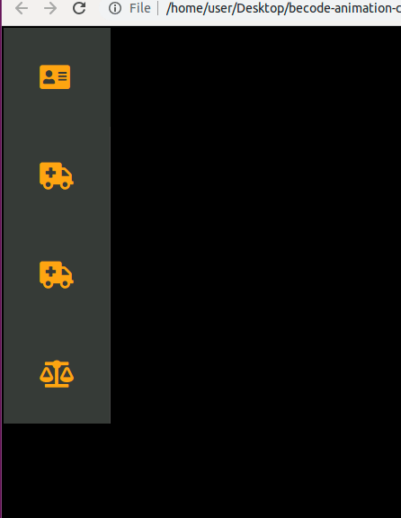
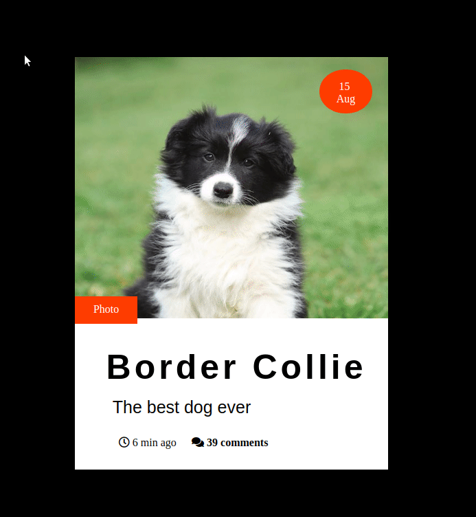

# Les animations SCSS

### Objectifs d'apprentissage

  
  - Apprendre les bases de l'animation
  - Utiliser le SCSS
  - Appronfondir le css
  
  
### Etapes de l'exercice

En premier lieux nous devions reproduire 3 boutons avec chacun une animation différente :

Voici le résultat que j'ai obtenu :

La deuxième étape était des créer un menu tel que celui là :

Et voilà mon résultat :

Le troisième et dernier exercice était de reproduire une carte animée :

Le résultat :

### Auteur

Github page :

Godfroid Emmanuel

Apprenant chez BeCode depuis le 16 avril 2019.